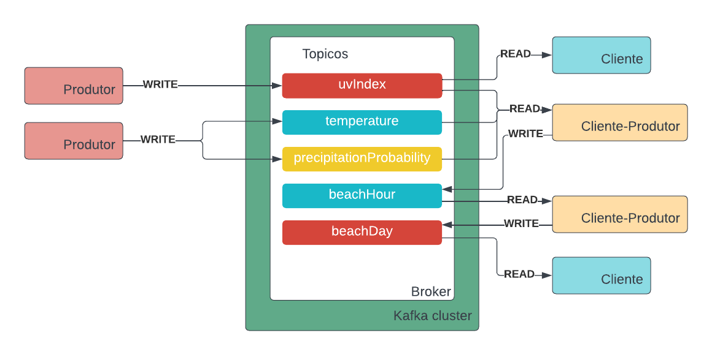
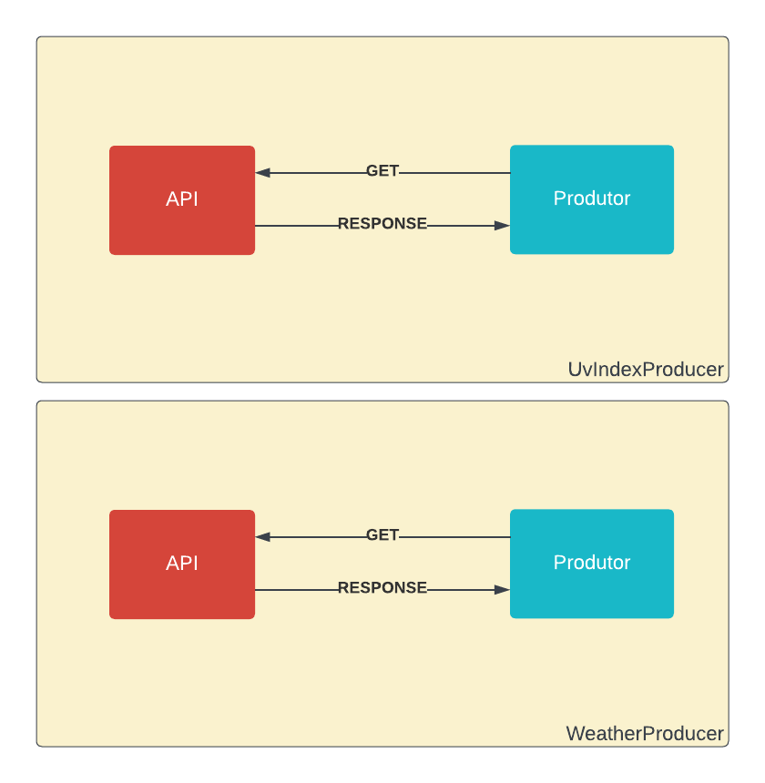

# Kafka Weather

The domain of the project is to determine whether it is a good day to go to the beach, given weather forecast events.
To do so, we use the [kafka platform](https://kafka.apache.org).


Implementation made by Beatriz Maia e Sophie Dilhon

## Implementation

The following image represents the comunication between the producers, clients and kafka server. Each of the topics are created with 3 partitions.



### Producer
There are two type of producers: [weather producer](producers/weather_producer.py) and [uv producer](producers/uv_producer.py). The first one gets precipitation probability and temperature hourly forecast for the next 3 days from the [weather forecast api](https://open-meteo.com/en/docs).

The second one gets the uv index hourly forecast for the next 3 days from the [air quality api](https://open-meteo.com/en/docs/air-quality-api).



Those events are captured for a few cities defined in this [file](./assets/cities.json). When pushed to the kafka server, events use the city name as the key to maintain time progression between events of the same city.

### Client-Producer
The client producers are responsible for creating the complex events. The first one, [beach hour](client_producers/beach_hour_producer.py), consumes all 3 primitive events and defines whether each hour is good to go to the beach. Bellow are the definitions: 

- uv index < 5
- precipitation probability < 30
- weather > 20 ºC

The second client producer ([beach day](client_producers/beach_day_producer.py)) consumes the beach hour data to create a new event containing the ranges of good times to go to the beach.

### Client
Finally, two clients were implemented. One just to consume the beach day events for a specified city, and the other one to show the current uv index at a specific city.

## Running the application
### Configuring docker

To run the application you can configure the docker with following commands (the last one attaches shell to the dev container):
```sh
docker-compose up
docker exec -it dev bash
```

Then, you may use the fast api or run the producers and clients via terminal, it's important to follow this sequence:
```sh
python3 producers/weather_producer.py
python3 producers/uv_producer.py

python3 client_producers/beach_hour_producer.py
python3 client_producers/beach_day_producer.py

python3 client/beach_day_client.py
python3 client/unsafe_uv_client.py
```

To access the fast api after build, input [http://localhost:8000/docs#/](http://localhost:8000/docs#/) into browser.

## Running outside of docker

If you are to run outside of docker, be sure to have Kafka installed, compatible with version 2.12-3.2.0. All code was made with Python 3.10. In order to run it, create a virtual environment and install dependencies via command:

```sh
pip install -r requirements.txt
```

To configure kafka, please configure the environment variables `ZOOKEEPER_SERVER` and `KAFKA_SERVER` in the [.env](.env) file. This variable can be configured to `localhost`. When running docker, these variables must be set to:

```sh
KAFKA_SERVER=kafka
ZOOKEEPER_SERVER=zookeeper
```

To build the zookeeper server, execute the command:

```sh
/kafka/bin/zookeeper-server-start.sh /kafka/config/zookeeper.properties
```

This is considering that Kafka is installed in the root folder and doesn't have PATH configured. Adapt this command to your machine.

To build the kafka server, execute the command:

```sh
/kafka/bin/kafka-server-start.sh /kafka/config/server.properties --override zookeeper.connect=${ZOOKEEPER_SERVER}:2181 --override log.retention.minutes=59 --override log.retention.check.interval.ms=300000
```

The same observation made for the zookeeper server is applicable to the kafka server. 

To create the topics, run the command:
```sh
sh ./create_topics.sh
```

To run the API, run the command:
```sh
uvicorn main:app --reload --host 0.0.0.0 --port 8000
```

# Ref
- [Uv index limit](https://www.aimatmelanoma.org/melanoma-101/prevention/what-is-ultraviolet-uv-radiation/#:~:text=The%20UV%20Index%20Scale&text=UV%20Index%203%2D5%20means,harm%20from%20unprotected%20sun%20exposure.)
- [Open meteo](https://open-meteo.com)