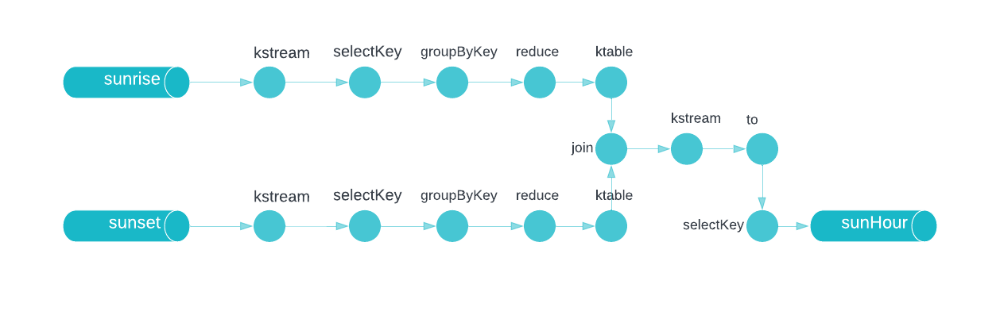
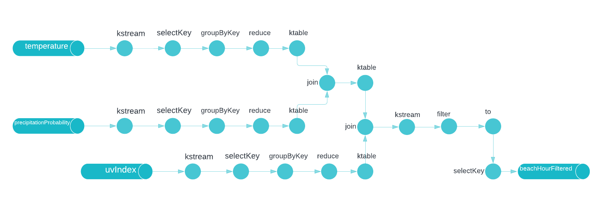
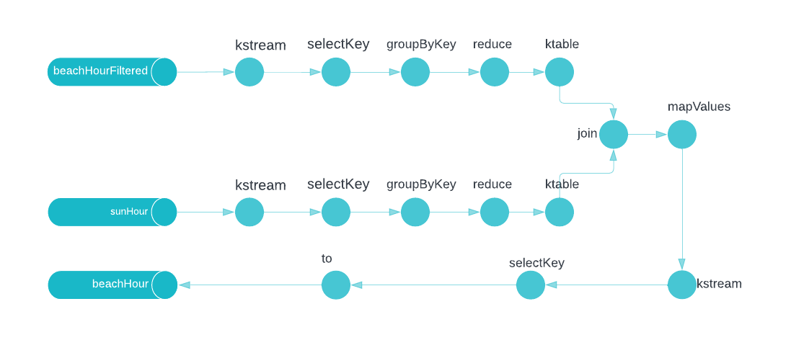
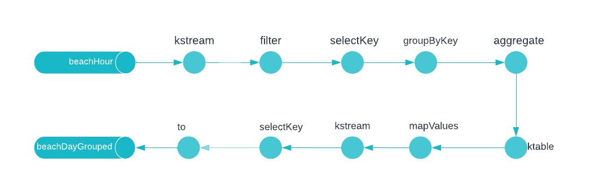
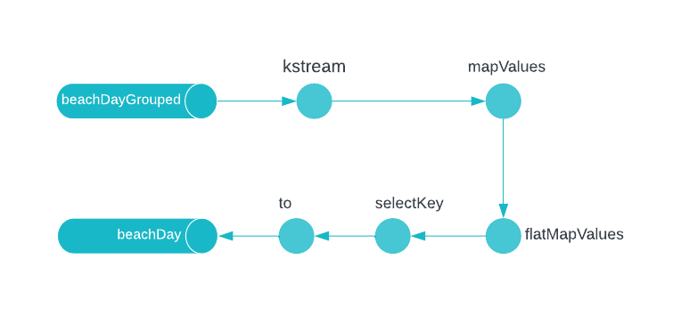

# Kafka Weather

The domain of the project is to determine whether it is a good day to go to the beach, given weather forecast events.
To do so, we use the [kafka platform](https://kafka.apache.org), [kafka streams](https://kafka.apache.org/documentation/streams/) and [kafka python package](https://kafka-python.readthedocs.io/en/master/).


Implementation made by Beatriz Maia e Sophie Dilhon

## Implementation

Implementation was made considering three major situations:
- Obtention of primitive information related to climate condition.
- Grouping of climate information by hour, of what's considered a good beach day.
- Grouping of climate information by period, of what's considered a good beach day.

In order for a day to be considered a good beach day, it must follow the following rules:
- Weather above 20 degrees Celcius.
- UV index rays below 5.
- Preciptation probability below 30.

### Producer
There are three type of primitive events producers: [weather producer](producers/weather_producer.py), [uv producer](producers/uv_producer.py) and [sunset and sunrise producer](procuders/sunser_sunrise_producer.py). The first one gets precipitation probability and temperature hourly forecast for the next 7 days from the [weather forecast api](https://open-meteo.com/en/docs). The second one gets the uv index hourly forecast for the next 5 days from the [air quality api](https://open-meteo.com/en/docs/air-quality-api). The third one gets daily information about the time of the sunrise and sunset for the next 7 days, also from the [weather forecast api](https://open-meteo.com/en/docs). 

Those events are captured for a few cities defined in this [file](./assets/cities.json). When pushed to the kafka server, events use the city name as the key to maintain time progression between events of the same city.

The topics created in order to store these informations are:
- temperature
- precipitationProbability
- uvIndex
- sunrise
- sunset

All of these primitive events are created using python.

### Consumers and consumer-producers

For more complex events, kafka stream was used and classes can be found in [kafkaWeather](src/main/java/kafkaWeather/).

The class [SunHour](src/main/java/kafkaWeather/SunHour.java) is responsible for joining events in the topics sunrise and sunset, creating objects with information about sunrise and sunset given a certain day, and all of the news objets are pused into the topic sunHour. In the image below, the architecture topology can be better visualized.



The class [BeachHourFiltered](src/main/java/kafkaWeather/BeachHourFiltered.java) is responsible for joining information related to the topics temperature, precipitationProbability and uvIndex. The information is joined related to information that are from the same place as well as the same time and day. Two joins were needed to be made due to the fact that we are dealing with three topics. In the end, we also filter for null values, in case of any corrupt data that wasn't properly treated before pulling from the APIs. All new events are sent to the topic beachHourFiltered.  



The class [BeachHour](src/main/java/kafkaWeather/BeachHour.java) is responsible for joining information from events from the topic beachHourFiltered and sunHour, and then manipulating the data and adding information whether that hour is a good hour or not to go to the beach, as well if it's daytime or not. Since sunHour information is daily and beachHourFiltered is hourly, when joining the information, a foreignKeyExtractor function was used to map out values from beachHourFiltered to sunHour. The logic if it was a good beach day as well as if it was daytime was applied in the mapValues step, shown in the image below.



The class [BeachDayGrouped](src/main/java/kafkaWeather/BeachDayGrouped.java) is responsible for aggregating beach hourly events into a one daily event. So various events became one with this stream. The events were grouped by day, city, as well if it was a good day to go to the beach and if it was daytime or not. Since bad days aren't used, this information was filtered previously. The new events were incorporated a new key called "intervalos" composed of various json objets with the key "hora", where all of the objects represented time that fitted the grouped information mentioned previously (city, day, good day, daytime). These objects were then sorted so that the information had a sense of order. They were then sent to the topic beachDayGrouped.



The last class implemented was [BeachDay](src/main/java/kafkaWeather/BeachDay.java). This class is responsible of taking the information from the topic beachDayGrouped and getting the information from the key "intervalos" and creating new events with periods of time that were specific related to city, if it was a good day and also daytime or not, specifing the start and ending of that period. An example would be, in the topic beachDayGrouped, the events would have the following information in the "intervalos" key:

```
intervalos: [{hora: "2023-07--06T07:00", 
              hora: "2023-07--06T08:00",
              hora: "2023-07--06T010:00",
              hora: "2023-07--06T011:00",
              hora: "2023-07--06T012:00",
              hora: "2023-07--06T015:00" }]
```

After going through the BeachDay stream, this one event would be then turned into 3 new events (the example will only show information regarding the keys "inicio" and "fim", which means the start and ending of the periods):

```
event 1:
inicio: 2023-07--06T07:00
fim:    2023-07--06T08:59

event 2:
inicio: 2023-07--06T010:00
fim:    2023-07--06T012:59

event 3:
inicio: 2023-07--06T015:00
fim:    2023-07--06T015:59
```

It's important to first group all of the beach hour events into one day event and then break it apart again due to the fact that the amount of periods in a day where it's a nice weather to go to the beach is unknown and can vary. 

All of the new events are then sent to the topic BeachDay.

It's important to point out that a lot of the times KTables were used to manipulate data, and due to that a new key usually had to be selected in order to have a unique key per table. That is why in all topologies, in the end there is a selectKey, this guarantees that we change the key back to city when sending it to the topic. This means that all events of a given city can be found in specific partition. 



In order to organize dependencies and run each class, the build tool [gradle](https://gradle.org/) was used.

## Application

The application uses FastApi for the backend and React for the frontend. The idea of the application is an agenda where you can see events by either time slots that can be longer than an hour, or hourly events, related to periods of times that are good to go to the beach. You can also filter to view only events that occur during daytime, in case you are not interested in event that occur during nighttime or when the sun isn't out.

### Backend

The backend is composed of 6 endpoints, with them being:
- GET /all_beach_day/
- GET /beach_day/
- GET /all_beach_hour/
- GET /beach_hour/
- GET /all_uv_index/
- GET /uv_index/

The endpoints `/beach_day/`, `/beach_hour/`, and `/uv_index/` all take a manditory parameter related to the city that the information is desired. The names are pretty self explanitory, gathering information from the topic in question. 

### Frontend

The frontend application consumes information from the endpoints `/beach_day/` and `/beach_hour/`.  When the toggle `Mostrar período` is activated, the agenda will showcase information bundled by periods, instead of hourly. Once it's deactivated, it shows hourly information. There is also a checkbox `Durante dia`, that once selected shows information that occurs when the sun is out (daytime).

The application is made using node.js and dependecies can be found in package.json. These were not included in the dockerfile nor docker-compose, therefor it's important that you have node installed in your machine before running. The scripts are also managed using yarn.

## Running the application
### Configuring docker

To run the application you can configure the docker with following commands (the last one attaches shell to the dev container):
```sh
docker-compose up
docker exec -it dev bash
```

Then, you may use the fast api or run the producers via terminal, it's important to follow this sequence:
```sh
python3 producers/weather_producer.py
python3 producers/uv_producer.py
python3 producers/sunset_sunrise_producer.py
```

In order to run the java classes, each class has a task that can be executed and found in the [build.gradle](build.gradle) file. The commands are:
```sh
gradle runSunHour
gradle runBeachHourFiltered
gradle runBeachHour
gradle runBeachDayGrouped
gradle runBeachDay
```

To access the fast api after build, input [http://localhost:8000/docs#/](http://localhost:8000/docs#/) into browser.

In order to visualize the application, it's important to have yarn installed in your computer, as well as node.js LTS. To run the application, from the root folder, run the following commands in the terminal:
```sh
cd app/frontened/kafka-wetaher
yarn start
```

## Running outside of docker

If you are to run outside of docker, be sure to have Kafka installed, compatible with version 2.12-3.2.0. All code was made with Python 3.11. In order to run it, create a virtual environment and install dependencies via command:

```sh
pip install -r requirements.txt
```

To configure kafka, please configure the environment variables `ZOOKEEPER_SERVER` and `KAFKA_SERVER` in the [.env](.env) file. This variable can be configured to `localhost`. When running docker, these variables must be set to:

```sh
KAFKA_SERVER=kafka
ZOOKEEPER_SERVER=zookeeper
```

To build the zookeeper server, execute the command:

```sh
/kafka/bin/zookeeper-server-start.sh /kafka/config/zookeeper.properties
```

This is considering that Kafka is installed in the root folder and doesn't have PATH configured. Adapt this command to your machine.

To build the kafka server, execute the command:

```sh
/kafka/bin/kafka-server-start.sh /kafka/config/server.properties --override zookeeper.connect=${ZOOKEEPER_SERVER}:2181 --override log.retention.minutes=59 --override log.retention.check.interval.ms=300000
```

The same observation made for the zookeeper server is applicable to the kafka server. 

To create the topics, run the command:
```sh
sh ./create_topics.sh
```

To run the API, run the command:
```sh
uvicorn main:app --reload --host 0.0.0.0 --port 8000
```

The instruction realted to the frontend are the same, with node.js and yarn installed, run the following command:
```sh
cd app/frontened/kafka-wetaher
yarn start
```


# Ref
- [Uv index limit](https://www.aimatmelanoma.org/melanoma-101/prevention/what-is-ultraviolet-uv-radiation/#:~:text=The%20UV%20Index%20Scale&text=UV%20Index%203%2D5%20means,harm%20from%20unprotected%20sun%20exposure.)
- [Open meteo](https://open-meteo.com)